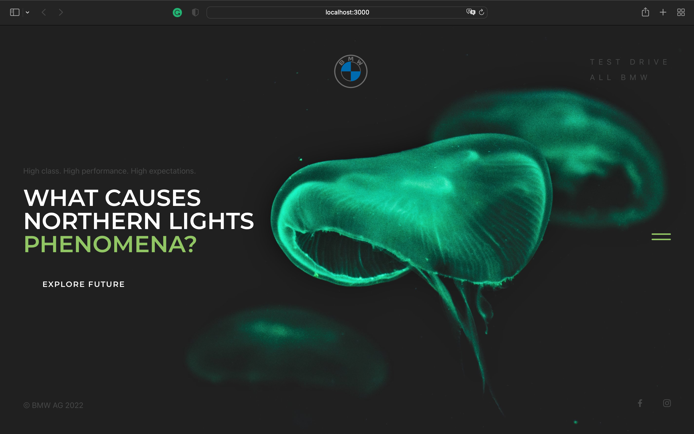

# THE 8

## Overview

This project is a React-based website showcasing the BMW 8 Series vehicles, featuring various sections including a main page, car gallery, design details, and more. It utilizes Tailwind CSS for styling and React for building interactive components.

## Table of Contents

- [BurgerMenu.js](#burgermenujs)
- [Creator.js](#creatorjs)
- [Design.js](#designjs)
- [Footer.js](#footerjs)
- [Gallery.js](#galleryjs)
- [Header.js](#headerjs)
- [Information.js](#informationjs)
- [Main.js](#mainjs)
- [NewsLetter.css](#newslettercss)
- [NewsLetter.js](#newsletterjs)
- [Performance.js](#performancejs)
- [Shape.js](#shapejs)
- [bmw.json](#bmwjson)
- [App.js](#appjs)
- [App.test.js](#apptestjs)
- [index.css](#indexcss)
- [index.js](#indexjs)
- [tailwind.config.js](#tailwindconfigjs)

## BurgerMenu.js

The `BurgerMenu` component implements a collapsible side menu that slides in and out when toggled. It includes a list of BMW car models fetched from `bmw.json`, along with a search bar and globe icon. The menu's visual state is toggled using React's `useState` hook, with animations controlled via inline styles.

### Key Features

- **Toggles Menu Visibility:** Changes the menu's position and burger icon animation based on whether the menu is open or closed.
- **Dynamic Car List:** Displays a list of car models with images and links.

## Creator.js

The `Creator` component features information about Domagoj Dukec, the head of BMW i and BMW M design. It includes a quote about the future of automotive design, a brief biography, and an image of Dukec.

### Key Features

- **Quote Section:** Highlights a key quote with an associated image.
- **Designer Profile:** Displays Dukec's name, role, and an image.

## Design.js

The `Design` component showcases BMW's design elements with images of various car designs. It emphasizes the evolution of BMW's design language with a blend of visuals and text.

### Key Features

- **Design Images:** Multiple images showing BMW's design evolution.
- **Text Description:** Provides context and explanation for the design choices.

## Footer.js

The `Footer` component includes links to BMW's official social media pages and a copyright notice.

### Key Features

- **Social Media Links:** Icons linking to BMW's Facebook and Instagram pages.
- **Copyright Information:** Displays the current year and BMW's legal notice.

## Gallery.js

The `Gallery` component presents a scrollable view of BMW vehicle images. It uses the `ModelBox` component to display individual photos.

### Key Features

- **Scrollable Gallery:** Allows horizontal scrolling through a collection of car images.
- **Dynamic Photo Rendering:** Uses an array of photo IDs to render gallery items.

## Header.js

The `Header` component displays the BMW logo and a link to the test drive section. It's designed to be fixed at the top of the page.

### Key Features

- **Logo:** Provides a link to the main page with the BMW logo.
- **Navigation Links:** Includes a link to the test drive section.

## Information.js

The `Information` component features a video and text describing BMW's design philosophy. It includes a background image and a headline with a supporting description.

### Key Features

- **Background Video:** Shows a video that plays automatically.
- **Text Content:** Provides information about BMW's design innovations.

## Main.js

The `Main` component serves as the landing page with an engaging headline and a call-to-action button. It dynamically adjusts the background size based on scroll position.

### Key Features

- **Background Animation:** Adjusts the background size on scroll to create a dynamic effect.
- **Call-to-Action:** Includes a button linking to the Information section.

## NewsLetter.css

This CSS file styles the newsletter section with a gradient overlay to enhance visual appeal.

### Key Features

- **Gradient Overlay:** Creates a gradient effect over the newsletter background.

## NewsLetter.js

The `NewsLetter` component highlights BMW news with images and a call-to-action to explore further. It uses a combination of text and images to draw attention.

### Key Features

- **News Highlights:** Displays images and text related to BMW news.
- **Call-to-Action:** Encourages users to explore more content.

## Performance.js

The `Performance` component emphasizes the performance aspects of BMW vehicles with text and background images.

### Key Features

- **Performance Description:** Provides a detailed description of BMW's performance features.
- **Visual Appeal:** Uses background images to enhance the design.

## Shape.js

The `Shape` component highlights BMW's design language with a quote from Adrian Van Hooydonk. It includes a background image and a text section.

### Key Features

- **Designer Quote:** Features a quote from BMW's design head.
- **Background Image:** Uses a background image to complement the text.

## bmw.json

This JSON file contains data about various BMW car models, including model names, series, body types, and image filenames.

### Key Features

- **Car Data:** Provides detailed information about each car model for use in the app.

## App.js

The `App` component serves as the main entry point for the application, rendering all the other components in a structured layout.

### Key Features

- **Component Integration:** Assembles all components into a single page.

## App.test.js

This file contains a basic test for the `App` component to ensure it renders correctly.

### Key Features

- **Basic Test:** Checks if a specific text is present in the rendered output.

## index.css

This CSS file includes Tailwind's base, components, and utilities. It also imports Google Fonts and sets global styles.

### Key Features

- **Global Styles:** Defines base styles for the application.

## index.js

The `index.js` file initializes the React application and renders the `App` component.

### Key Features

- **Application Initialization:** Renders the main `App` component into the DOM.

## tailwind.config.js

This configuration file extends Tailwind CSS with custom colors, font families, and background images.

### Key Features

- **Custom Configuration:** Adds custom styling options to Tailwind CSS.

## Getting Started

1. **Clone the Repository:**

   ```bash
   git clone https://github.com/the-8.git
   cd the-8
   ```

2. **Install Dependencies:**

   ```bash
   npm install
   ```

3. **Run the Application:**

   ```bash
   npm start
   ```

4. **Build for Production:**

   ```bash
   npm run build
   ```

5. **Run Tests:**

   ```bash
   npm test
   ```

## Contributing

Contributions are welcome! Please follow the standard Git workflow:

1. **Fork the Repository**
2. **Create a Branch**
3. **Make Your Changes**
4. **Submit a Pull Request**

## License

This project is licensed under the MIT License. See the [LICENSE](./LICENSE) file for details.